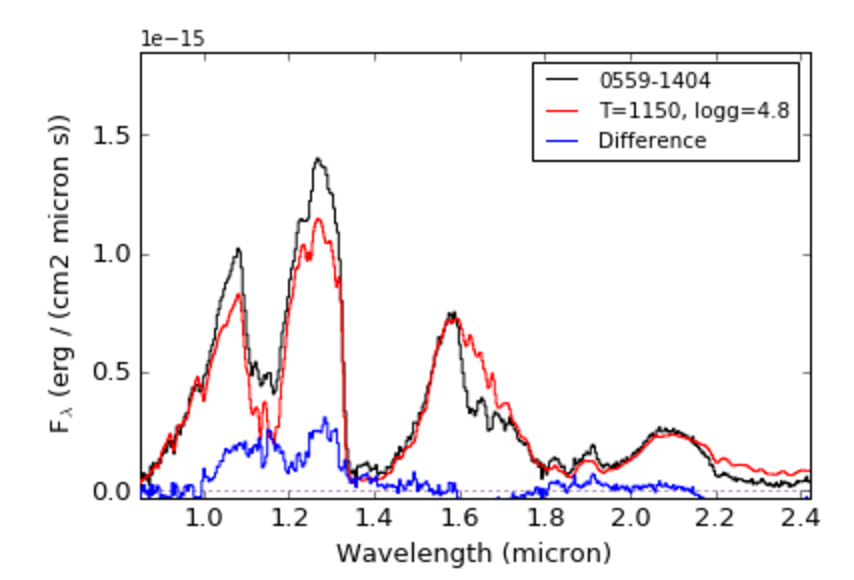
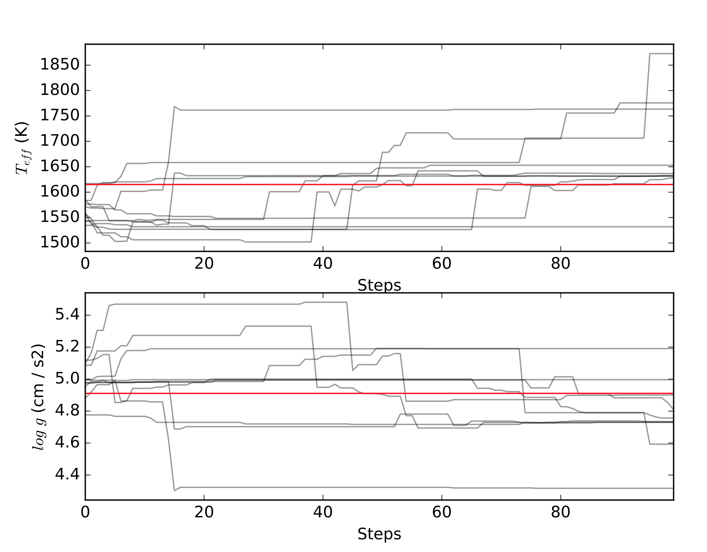
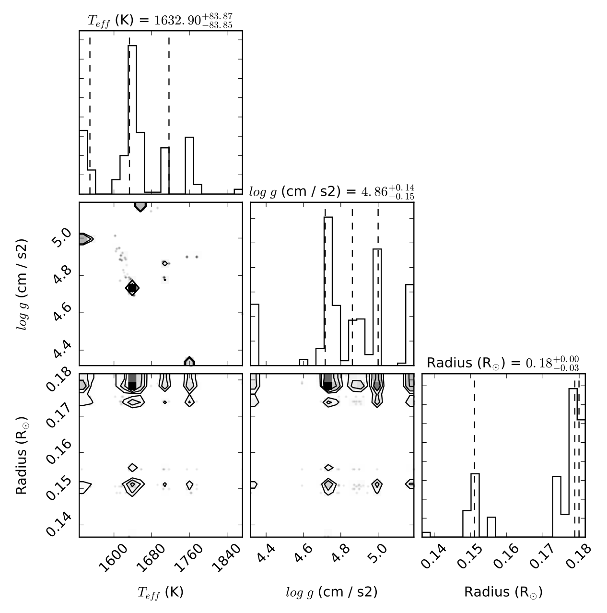

.. SpeX Prism Library Analysis Toolkit documentation master file, created by
   sphinx-quickstart on Sat Jul 11 20:07:28 2015.
   You can adapt this file completely to your liking, but it should at least
   contain the root `toctree` directive.

SPLAT Spectral Modeling
=======================

.. toctree
   :maxdepth: 3

.. _`SPLAT Spectrum class` : api.html#spectrum
.. _`loadModel()` : api.html#splat_model.loadModel
.. _`loadInterpolatedModel()` : api.html#splat_model.loadInterpolatedModel
.. _`getModel()` : api.html#splat_model.getModel
.. _`fluxCalibrate()` : api.html#splat.fluxCalibrate
.. _`compareSpectra()` : api.html#splat.compareSpectra
.. _`typeToTeff()` : api.html#splat.typeToTeff
.. _`checkModelName()` : api.html#splat_model.checkModelName
.. _`modelFitGrid()` : api.html#splat_model.modelFitGrid
.. _`modelFitMCMC()` : api.html#splat_model.modelFitMCMC
.. _`modelFitEMCEE()` : api.html#splat_model.modelFitEMCEE

The SPLAT spectral modeling package provides tools for reading in, comparing, fitting spectral models to the spectral data contained in the SPL, and visualizing the results. 

The spectral models contained in SPLAT are located in the code's reference/SpectralModels folder, and include the following:

    - `Allard et al. (2012) <http://adsabs.harvard.edu/abs/2012RSPTA.370.2765A>`_  with effective temperatures of 400 to 2900 K (steps of 100 K); surface gravities of 3.5 to 5.5 in units of cm/s^2 (steps of 0.5 dex); and metallicity of -3.0, -2.5, -2.0, -1.5, -1.0, -0.5, 0.0, 0.3, and 0.5 for temperatures greater than 2000 K only; cloud opacity is fixed in this model, and equilibrium chemistry is assumed. Note that this grid is not completely filled and some gaps have been interpolated.
    - `Burrows et al. (2006) <http://adsabs.harvard.edu/abs/2006ApJ...640.1063B>`_  with effective temperatures of 700 to 2000 K (steps of 50 K); surface gravities of 4.5 to 5.5 in units of cm/s^2 (steps of 0.1 dex); metallicity of -0.5, 0.0 and 0.5; and either no clouds or grain size 100 microns (fsed = 'nc' or 'f100'). equilibrium chemistry is assumed. Note that this grid is not completely filled and some gaps have been interpolated.
    - `Morley et al. (2012) <http://adsabs.harvard.edu/abs/2012ApJ...756..172M>`_  with effective temperatures of 400 to 1300 K (steps of 50 K); surface gravities of 4.0 to 5.5 in units of cm/s^2 (steps of 0.5 dex); and sedimentation efficiency (fsed) of 2, 3, 4 or 5; metallicity is fixed to solar, equilibrium chemistry is assumed, and there are no clouds associated with this model.
    - `Morley et al. (2014) <http://adsabs.harvard.edu/abs/2014ApJ...787...78M>`_  with effective temperatures of 200 to 450 K (steps of 25 K) and surface gravities of 3.0 to 5.0 in units of cm/s^2 (steps of 0.5 dex); metallicity is fixed to solar, equilibrium chemistry is assumed, sedimentation efficiency is fixed at fsed = 5, and cloud coverage fixed at 50%.
    - `Saumon et al. (2012) <http://adsabs.harvard.edu/abs/2012ApJ...750...74S>`_  with effective temperatures of 400 to 1500 K (steps of 50 K); and surface gravities of 3.0 to 5.5 in units of cm/s^2 (steps of 0.5 dex); metallicity is fixed to solar, equilibrium chemistry is assumed, and no clouds are associated with these models.
    - `Witte et al. (2011) <http://adsabs.harvard.edu/abs/2011A%26A...529A..44W>`_  with effective temperatures of 1700 to 3000 K (steps of 50 K); surface gravities of 5.0 and 5.5 in units of cm/s^2; and metallicities of -3.0 to 0.0 (in steps of 0.5 dex); cloud opacity is fixed in this model, equilibrium chemistry is assumed.

The model parameters that may be set is determined by the model:

	- **teff**: effective temperature in K
	- **logg**: log10 of the surface gravity in cm/s2
	- **z**: log10 of metallicity relative to solar metallicity
	- **fsed**: sedimentation efficiency (e.g., 'f100' in Burrows models; 'f2' in Morley and Saumon models)
	- **cld**: cloud coverage fraction, used in `Morley et al. (2014) <http://adsabs.harvard.edu/abs/2014ApJ...787...78M>`_ models  (e.g. `cld` = 'f50')
	- **kzz**: vertical eddy diffusion coefficient (not currently in use)

In addition, one can set:

	- **slit**: slit weight of the model in arcseconds; by default this is 0.5
	- **sed**: if set to True, returns a broad-band spectrum spanning 0.3-30 micron (only for BTSettl2008 models with Teff < 2000 K)

If you aren't sure what the name of the model is, you can always check it with `checkModelName()`_

    >>> import splat
    >>> splat.checkModelName('burrows')
        burrows06

Reading in models
-----------------

Models are read in using the `getModel()`_  or `loadModel()`_ routines:

    >>> import splat
    >>> mdl = splat.getModel(teff=1000,logg=5.0)
    >>> mdl.info()
        BTSettl2008 model with the following parmeters:
        Teff = 1000 K
        logg = 5.0 cm/s2
        z = 0.0
        fsed = nc
        cld = nc
        kzz = eq
        Smoothed to slit width 0.5 arcseconds
    >>> mdl.plot()

.. image:: _images/btsettl_model.png
	:width: 400
	:align: center

The output is an instance of the `SPLAT Spectrum class`_ , and thus inherits all of the aspects and functions of that class, with wavelength in microns, surface fluxes in F\_lambda units of erg/cm\^2/s/micron, and an noise array that is all ``nan`` values.

For parameters that are between model grid points, the function `loadInterpolatedModel()\_ is called, which performs log linear interpolation on nearest neighbor models.

Models can be compared to spectra using the `compareSpectra()`_ function:

    >>> import splat
    >>> sp = splat.getSpectrum(shortname='0559-1404')[0]
    Retrieving 1 file
    >>> mdl = splat.getModel(teff=1150,logg=4.8)
    >>> chi,scale = splat.compareSpectra(sp,mdl,plot=True,legend=['0559-1404','T=1150, logg=4.8','Difference'])
    >>> print(chi,scale)
    289659.7135897903 8.17592929309e-24

Note that the latter number provides the scale factor to multiple the model spectrum by to optimally match the data

	>>> mdl.scale(8.17592929309e-24)
	>>> mdl.fluxMax()
	1.1468954e-15 erg / (cm2 micron s)

If the data spectrum is absolutely flux calibrated (using the `fluxCalibrate()`_ routine with ``absolute`` = True), then the radius can be computed from this scale factors as (scale \* 10 parsec)\*\*0.5.

Fitting models
--------------

There are three routines currently available for finding the optimal model to match a given spectrum:

`modelFitGrid()`_
^^^^^^^^^^^^^^^^^

This routine compares a spectrum to the full or subset of a model grid, comparing only to the grid points (i.e., no model interpolation). You can constrain the grid points by setting the ``teff_range``, ``logg_range`` or ``z_range`` with a two-element array specifying minimum and maximum values. The default comparison statistic is chi-square, but you can choose any of the statistics defined in `compareSpectra()`_ ; mask and/or weight vectors can all set. 

All models on the grid are compared to the spectrum and the best fit model parameters are returned as dictionary. The code also computes the fit-statistic-weighted mean and uncertainty values of temperature, surface gravity and metallicity (and radius, see below), which can be returned by setting ``return_mean_parameters`` = True.  You can also return all the parameter fits (``return_all_parameters`` = True) or the properly scaled best-fit model spectrum (``return_model`` = True).  Plots to the best-fit and mean-parameter models are output to files prefixed by the ``output`` keyword.

If the spectrum is absolutley flux calibrated with the `fluxCalibrate()`_ routine, `modelFitGrid()`_ will also compute and return the radius corresponding to the scale factor for the model.

 
Example:

    >>> import splat
    >>> sp = splat.Spectrum(shortname='1507-1627')[0]
    >>> sp.fluxCalibrate('2MASS J',12.32,absolute=True)
    >>> p = splat.modelFitGrid(sp,teff_range=[1200,2500],model='Saumon',file='fit1507')
        Best Parameters to fit to BT-Settl (2008) models:
            $T_{eff}$=1800.0 K
            $log\ g$=5.0 dex(cm / s2)
            $[M/H]$=-0.0 dex
            $f_{sed}$=nc 
            $cld$=nc 
            $log\ \kappa_{zz}$=eq dex(cm2 / s)
            R=0.143324498969 solRad
            chi=4500.24997585
        Mean Parameters:
            $T_{eff}$: 1800.0+/-0.0 K
            $log\ g$: 5.0+/-0.0 dex(cm / s2)
            Radius: 0.143324498969+/-0.0 solRad
            $[M/H]$: 0.0+/-0.0 dex

.. image:: _images/test_modelfitgrid_best_comparison.png
    :width: 400
    :align: center

`modelFitMCMC()`_
^^^^^^^^^^^^^^^^^
A home brewed Markov Chain Monte Carlo routine that identifies the best-fit parameter space using a single chain. 

`modelFitEMCEE()`_
^^^^^^^^^^^^^^^^^^
This routine use the `emcee`_ package by Dan Foreman-Mackey et al. to perform Goodman & Weare's `Affine Invariant Markov chain Monte Carlo (MCMC) Ensemble sampler <http://msp.org/camcos/2010/5-1/p04.xhtml>`_ to fit a spectrum to a set of atmosphere models. The routine is initialized with a first best guess for model parameters (e.g., from `modelFitGrid()`_ or `typeToTeff()`_), an optional fitting range, a prior (normal) initial about the best guess, and an input model set. It then proceeds to generate a series of walkers (set by ``nwalkers``) that perform ``nsamples`` steps, of which an initial ``burn_fraction`` will be discarded.  The resulting chains are used to produce a posterior distribution for the fit parameters.  If the input spectrum is absolutely flux calibrated, then the corresponding radii are also calculated.  Like `modelFitMCMC()`_ , this routine currently only fits temperature, surface gravity and metallicity

The best fit parameters, parameter distributions, and visualization of the fit is provided in a series of output files which are updated iteratively through the computation

    - `filename_iterative.dat`: chain parameters
    - `filename_chains.pdf`: corner plot of parameters
    - `filename_comparison.pdf`: plot of spectrum compared to best fit model
    - `filename_corner.pdf`: corner plot of parameters
    - `filename_summary.txt`: summary of results

The prefix `filename` can be set with the ``filename`` keyword; the plot files' format can be set with the ``plot_format`` keyword.
    
This package requires the installation of the following external packages by Dan Foreman-Mackey et al.: 

    - `emcee <http://dan.iel.fm/emcee/current>`_
    - `corner <http://corner.readthedocs.io/en/latest>`_

Example:

    >>> import splat
    >>> sp = splat.Spectrum(shortname='1507-1627')[0]
    >>> sp.fluxCalibrate('2MASS J',12.16,absolute=True)
    >>> spt,spt_e = splat.classifyByStandard(sp)
    >>> teff,teff_e = splat.typeToTeff(spt)
    >>> result = modelFitEMCEE(sp,t0=teff,g0=5.0,fit_metallicity=False,model='BTSettl2008',\
    >>>    nwalkers=50,nsamples=500,output='/Users/adam/test_modelfitEMCEE')
        Estimated time to compute = 9228 seconds = 153.8 minutes = 2.56 hours = 0.11 days
        Do you want to continue? [Y/n]: 
        Progress: [**************************************************]

Outputs:

.. image:: _images/test_modelfitEMCEE_bestcomparison.png
	:width: 400
	:align: center

Comparison of data (black) to best fit model (blue), and the difference spectrum (grey)

Progression of chains for model parameters of temperature (top) and gravity (bottom), and the best fit values (red horizontal lines)

Corner plot showing distribution of model parameters (1D histograms) and parameter correlations (2D density plots). Radius is also shown because the data flux values were absolutely flux calibrated.

* :ref:`genindex`
* :ref:`modindex`
* :ref:`search`

